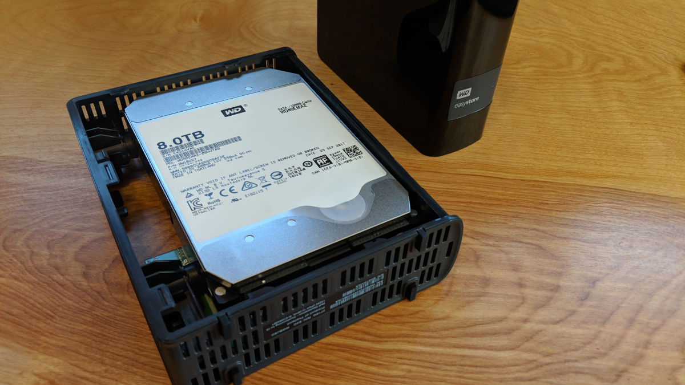

1. [Find a pc](/findpc.md)
2. [Find an OS to use](/os.md)
3. [Shuck external drives to be able to connect via SATA](drive.md)
4. [Put all hardware together with PC and HD](/hardware.md)
5. [Configure OS with shares, Plex and Transmission](configure.md)
The process of obtaining the drives was I had to first take the raw drives out of the case aka **shucking** to be able to link them with the pc via SATA cable. (the process shown below)

